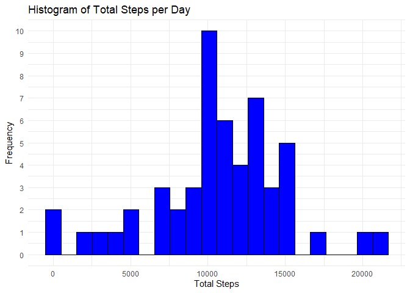
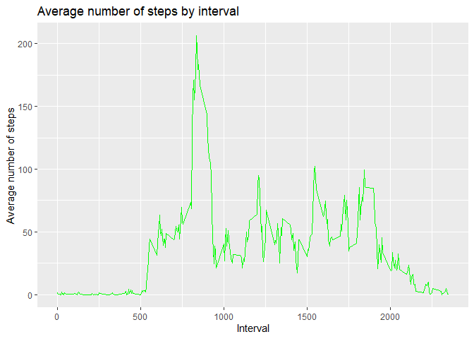
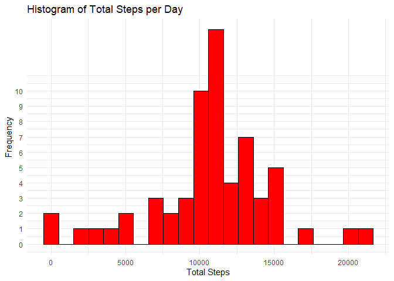
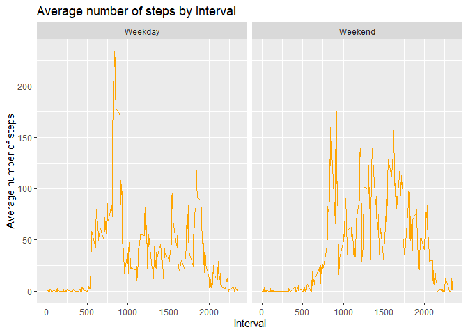

## Loading and preprocessing the data

```r
# Loading libraries
library(ggplot2)
library(dplyr)
```

```
## 
## Attaching package: 'dplyr'
```

```
## The following objects are masked from 'package:stats':
## 
##     filter, lag
```

```
## The following objects are masked from 'package:base':
## 
##     intersect, setdiff, setequal, union
```


```r
# Read data
unzip("activity.zip")
activity_df <- read.csv("activity.csv")
```


```r
# Set date column to date type
activity_df$date <- as.Date(activity_df$date)
```

## What is mean total number of steps taken per day?

The histogram below shows the total number of steps taken each day.


```r
# Group by date and add up steps 
activity_gb <- activity_df %>% group_by(date) %>% summarise(Sum = sum(steps))
```

```r
# Histogram of total steps per day 
ggplot(activity_gb, aes(x = Sum)) +
geom_histogram(bins=22,fill = "blue", color = "black",na.rm = TRUE,aes(y = after_stat(count))) + labs(title = "Histogram of Total Steps per Day",x = "Total Steps", y = "Frequency") + theme_minimal() + scale_y_continuous(breaks = seq(0, 10, by = 1))
```

<!-- -->

## What is the average daily activity pattern?


```r
# Calculate mean and median of steps taken each day 
mean_act <-mean(activity_gb$Sum,na.rm = TRUE)
median_act <-median(activity_gb$Sum,na.rm = TRUE)
mean_act
```

```
## [1] 10766.19
```

```r
median_act
```

```
## [1] 10765
```
The mean and median number of steps taken each day is 1.0766189\times 10^{4} and 10765.


```r
# Calculate the mean of the 'steps' variable for each unique value of the 'interval' variable in the 'activity_df' dataframe
mean_interval <- activity_df %>% group_by(interval) %>% summarise(mean_int = mean(steps, na.rm = TRUE))
```

The time series plot below shows the average number of steps taken. 


```r
# Plot time series plot
ggplot(mean_interval, aes(x = interval, y = mean_int)) +
        geom_line(color = "green") +
        ggtitle("Average number of steps by interval") +
        xlab("Interval") +
        ylab("Average number of steps")
```

<!-- -->


```r
# Calculate maximum number of average steps for each interval
row_index <- which.max(mean_interval$mean_int)
high_int <- mean_interval$interval[row_index]
high_int
```

```
## [1] 835
```
The 5-minute interval that, on average, that contains the maximum number of steps is interval 835.

## Imputing missing values


```r
# Calculate  the total number of missing values in the dataset
total_rows_with_na <- sum(rowSums(is.na(activity_df)) > 0)
total_rows_with_na
```

```
## [1] 2304
```
The total number of missing values is 2304

A strategy for filling in the missing values in the dataset is to use the mean for that 5-minute interval.


```r
#Join 'acticity_df' and 'mean_interval' to have the mean for each interval. Create a 'steps2' column and copy 'steps' values, if 'steps2' value is NA replace it with corresponding mean value
rows_with_nas <- sum(apply(activity_df, 1, function(row) any(is.na(row))))
activity_avg <- left_join(activity_df, mean_interval, by = "interval")
activity_avg$steps2 <- activity_avg$steps
activity_avg$steps2[is.na(activity_avg$steps2)] <- activity_avg$mean_int[is.na(activity_avg$steps2)]
activity_avg_new  <- activity_avg[, c("steps2","date", "interval")]
colnames(activity_avg_new)[which(colnames(activity_avg_new) == "steps2")] <- "steps"
```

The histogram below shows the total number of steps taken each day where the mean step for the interval was used if the data was not available.


```r
# Calculate the sum of the 'steps2' variable grouped by the 'date' variable in a dataframe called 'activity_avg'and create histogram 
activity_avg_gb <- activity_avg_new  %>% group_by(date) %>% summarise(sum_value = sum(steps))
ggplot(activity_avg_gb, aes(x = sum_value)) +
        geom_histogram( bins=22, fill = "red", color = "black",na.rm = TRUE) + labs(title = "Histogram of Total Steps per Day",x = "Total Steps", y = "Frequency") + theme_minimal() + scale_y_continuous(breaks = seq(0, 10, by = 1))
```

<!-- -->
Comparing to the previous histogram for most intervals the values remained the the frequency stayed the same however there is difference for interval 10000 and 12000.


```r
# Calculate mean and median of steps taken each day 
mean_act_new <-mean(activity_avg_gb$sum_value,na.rm = TRUE)
median_act_new <-median(activity_avg_gb$sum_value,na.rm = TRUE)
mean_act_new
```

```
## [1] 10766.19
```

```r
median_act_new
```

```
## [1] 10766.19
```
The mean and median number of steps taken each day is 1.0766189\times 10^{4} and 1.0766189\times 10^{4}. After filling in the missing values the mean remained the same but the median changed and has the same value as the mean.

## Are there differences in activity patterns between weekdays and weekends?


```r
# Create 'day' column with days of week and day_type column that determines whether it is a weekday or weekend. Set day_type to factor.  
activity_avg$day <- weekdays(activity_avg$date)
activity_avg$day_type <- ifelse(activity_avg$day %in% c("Saturday", "Sunday"), "Weekend", "Weekday")
activity_avg <- activity_avg %>% mutate(day_type =factor(day_type))
# Calculate the mean of the 'steps' variable grouped by both the 'interval' and 'day_type' variables in a dataframe called 'activity_avg
act_mean_interval <- activity_avg %>% group_by(interval, day_type) %>% summarise(mean_int = mean(steps, na.rm = TRUE))
```

```
## `summarise()` has grouped output by 'interval'. You can override using the
## `.groups` argument.
```


```r
# Create a panel plot containing a time series plot of the 5-minute interval (x-axis) and the average number of steps taken, averaged across all weekday days and weekend days
ggplot(act_mean_interval, aes(x = interval, y = mean_int)) +
        geom_line(color = "orange") +
        facet_wrap(~day_type, nrow = 1) +
        ggtitle("Average number of steps by interval") +
        xlab("Interval") +
        ylab("Average number of steps")
```

<!-- -->

The panel plot shows that there are differences in activity patterns between weekdays and weekends. There are two more prevalent peaks on the weekdays.  This might be due to the fact that people walk more before and after working hour. The weekend pattern shows more variery with more smaller peaks. 
